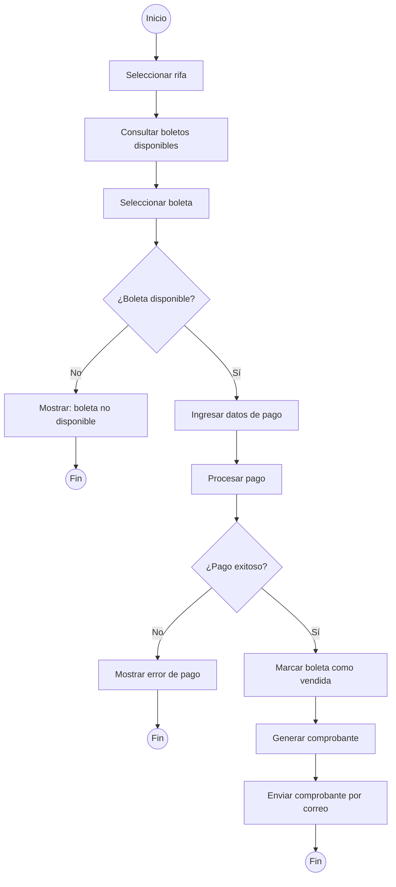

# 04 — Actividad Comprar Boleta

```mermaid
flowchart TD
  INICIO((Inicio)) --> A1[Seleccionar rifa]
  A1 --> A2[Consultar boletos disponibles]
  A2 --> A3[Seleccionar boleta]
  A3 --> D1{¿Boleta disponible?}
  D1 -- No --> M1[Mostrar: boleta no disponible] --> F1((Fin))
  D1 -- Sí --> A4[Ingresar datos de pago]
  A4 --> A5[Procesar pago]
  A5 --> D2{¿Pago exitoso?}
  D2 -- No --> M2[Mostrar error de pago] --> F2((Fin))
  D2 -- Sí --> A6[Marcar boleta como vendida]
  A6 --> A7[Generar comprobante]
  A7 --> A8[Enviar comprobante por correo] --> F3((Fin))
```

Corresponde 1:1 a tu XMI (`Activity Comprar Boleta`) y al `ServicioCompra.confirmar()` en código.
